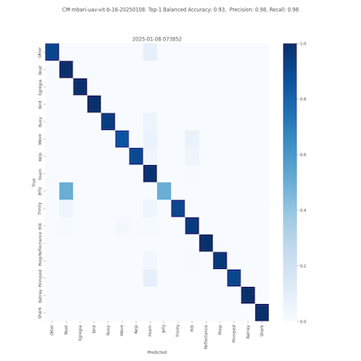
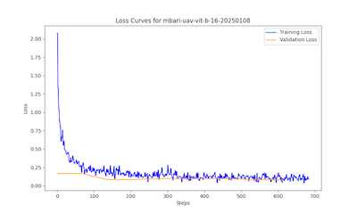

# Training library for fine-tuning ViTS (Vision Transformer) models on custom datasets

## Installation


### Create a new environment conda
```bash
conda env create
conda activate vitstrain
```

### If you prefer pyenv

```bash
pyenv virtualenv 3.11.0 vitstrain
pyenv activate vitstrain
pip install -r requirements.txt
```

## Usage

Step 1. Download the labeled data and crop the images using the [aidata repository](https://github.com/mbari-org/aidata)

Here, we are using the `config_uav.yml` configuration file to download the UAV dataset. 

```bash
cd aidata
python aidata download \
        --config config_uav.yml \
        --base-path $PWD  \
        --version Baseline \
        --token $TATOR_TOKEN --crop-roi --resize 224
```

Step 2. Train the model

```bash
python src/fine_tune_vit.py \
        --data-path $PWD/Baseline/crops \
        --base-model google/vit-base-patch16-224-in21k
        --model-name mbari-uav-vit-b16 \
        --epochs 30
```

Example output:
```text
/Volumes/DeepSea-AI/models/UAV/mbari-uav-vit-b16-20250108/
├── all_results.json
├── checkpoint-1710
│   ├── config.json
│   ├── model.safetensors
│   ├── optimizer.pt
│   ├── preprocessor_config.json
│   ├── rng_state.pth
│   ├── scheduler.pt
│   ├── trainer_state.json
│   └── training_args.bin
├── config.json
├── confusion_matrix_mbari-uav-vit-b16-20250108_2025-01-08 073852.png
├── eval_results.json
├── loss_curve_mbari-uav-vit-b16-20250108_2025-01-08_073852.png
├── model.safetensors
├── preprocessor_config.json
└── training_args.bin
```




last updated: 2025-03-23
