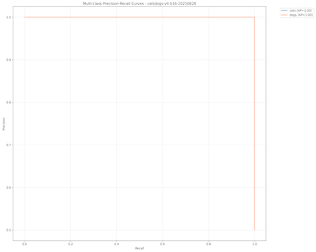

# Training library for fine-tuning ViTs (Vision Transformer) models on custom datasets

## Installation ⚙️ 


### Create a new environment conda
```bash
conda env create
conda activate vitstrain
```

### If you prefer pyenv

```bash
pyenv virtualenv 3.11.0 vitstrain
pyenv activate vitstrain
pip install -r requirements.txt
```

## Training 🚀  

### Step 1. Download the labeled data 


TL;DR: For a quick-start, use the included `data/catsdogs.tar.gz` file, which contains data in the required format.

```bash
tar -xvzf data/catsdogs.tar.gz
```

To download and crop data using the `mbari-aidata` package, see more detailed documentation in our
[aidata documentation](https://docs.mbari.org/internal/ai/classification-training/#training-a-classification-model).

 
Data should be in folder per class with and required stats.json file. 
For example, the folder structure should look like this:

```
└── crops
    ├── cats
    │   ├── cat.0.jpg
    │   ├── cat.1.jpg
    │   ├── cat.10.jpg
    │   ├── cat.100.jpg 
    ├── dogs
    │   ├── dog.0.jpg
    │   ├── dog.1.jpg
    │   ├── dog.10.jpg
    │   ├── dog.100.jpg 
    └── stats.json
```                                                                                                                                                                                          

The stats.json file should contain the following information:

```json
{ 
    "total_labels": {
        "cats": 100,
        "dogs": 100
    }
}
```

### Step 2. Train the model

```bash
python src/fine_tune_vit.py \
        --raw-data $PWD/data/crops \
        --base-model google/vit-base-patch16-224-in21k
        --model-name catsdogs-vit-b16 \
        --epochs 5
```

Example output:
```text
ccatsdogs-vit-b16-20250828
├── all_results.json
├── checkpoint-100
│   ├── config.json
│   ├── model.safetensors
│   ├── optimizer.pt
│   ├── preprocessor_config.json
│   ├── rng_state.pth
│   ├── scheduler.pt
│   ├── trainer_state.json
│   └── training_args.bin
├── config.json
├── confusion_matrix_catsdogs-vit-b16-20250828_2025-08-28_144843.png
├── eval_results.json
├── loss_curve_catsdogs-vit-b16-20250828_2025-08-28_144843.png
├── model.safetensors
├── pr_curves_catsdogs-vit-b16-20250828_2025-08-28_144843.png
├── preprocessor_config.json
└── training_args.bin
```

To remap the classes, use the `--remap` flag, passing in a file with a json formatted dictionary


```json

{
    "oldname" : "newname"
}
```

For example

```json
{
    "cats" : "felines",
    "dogs" : "canines"
}
```

Then a

```bash
python src/fine_tune_vit.py \
        ...
        --remap remap.json
```




last updated: 2025-08-28
